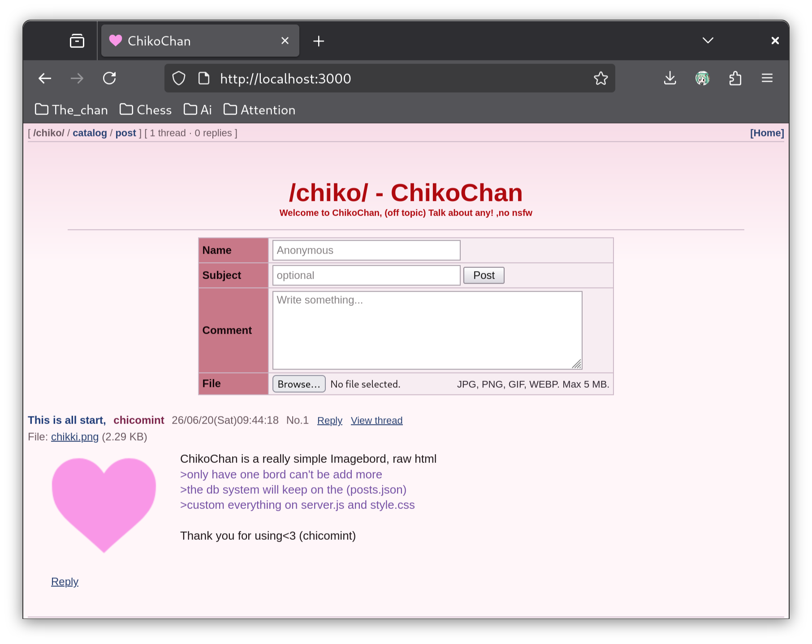
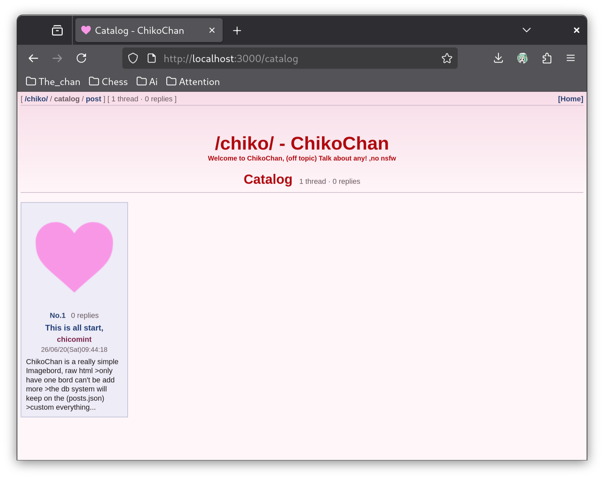
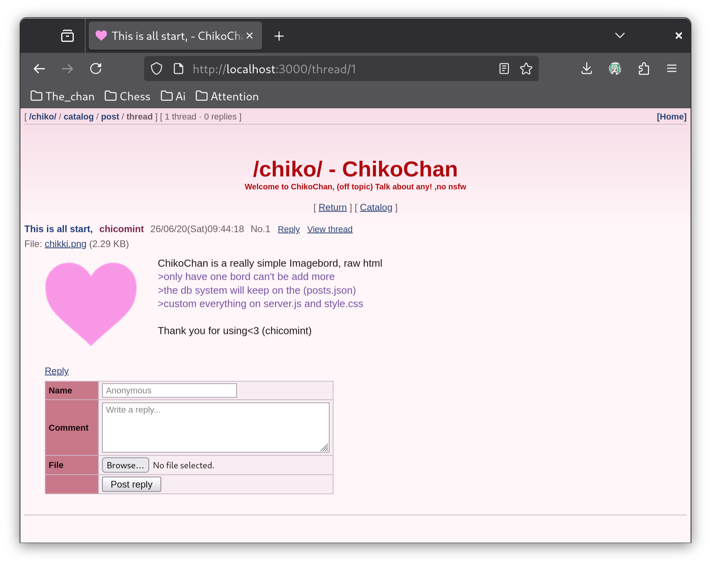

#  ChikoChan

ChikoChan is a really simple lightweight Imagebord, raw html, built with Node.js
>only Single board,
>,the db system will keep on the (posts.json)
>,custom everything on server.js and style.css
<br>

## Requirements

- Node.js
- npm

## Install

```bash
npm install
```

## Run

```bash
npm start
```

The server starts on:

```text
http://localhost:3000
```

To use a different port:

```bash
PORT=8080 npm start
```


