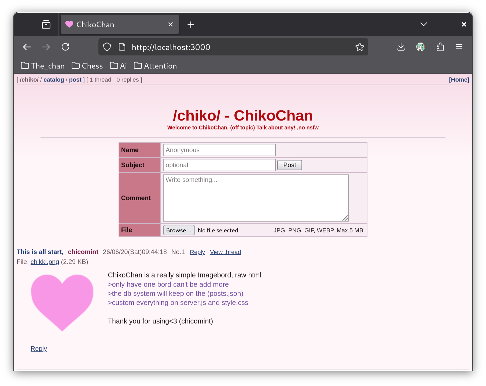

#  ChikoChan

ChikoChan is a lightweight, single-board imageboard written entirely in Node.js.<br>
The only database is `posts.json`; uploads are ordinary files in `src/`.


## Quick start

Requirements:

- Node.js 22 or newer; use an active LTS release
- npm, included with Node.js

Install and run:

```sh
git clone <your-chikochan-repository-url>
cd ChikoChan
npm install
npm start
```

Open <http://localhost:3000>. The server creates a missing `posts.json` and upload directory automatically. Existing original ChikoChan data is migrated in place on first start.

## Configuration

Defaults work without configuration. But you also can config in (config.js)

ChikoChan have the admin page, you can edit .env file by add:<br>
ADMIN_PASSWORD=replace-with-a-long-random-password<br>
ADMIN_SESSION_SECRET=replace-with-a-different-long-random-secret<br>
and you can access go into http://localhost:3000/admin 

