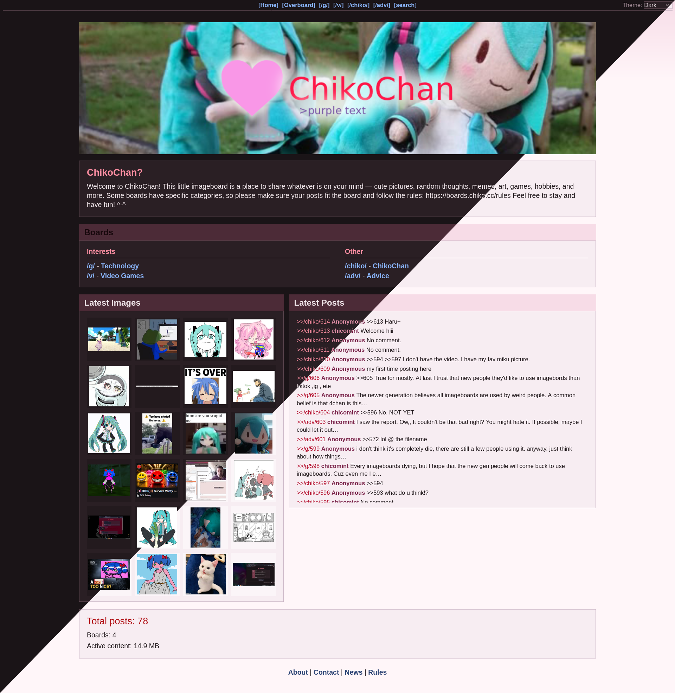

#  ChikoChan



A lightweight and simple imageboard built with Node.js.
ChikoChan supports multiple boards, file uploads, and can run locally without needing a database server.

## Getting Started

### Requirements

- Node.js 22 or newer
- npm
- Git

### Installation

Clone the repository:

```bash
git clone https://github.com/chicomint/ChikoChan.git
cd ChikoChan
```

Install the dependencies:

```bash
npm install
```

Start ChikoChan:

```bash
npm start
```

Then open:

```text
http://localhost:3000
```

Follow the setup on the page. Choose **Local storage** if you don't want to set up MongoDB.
Give your site a name, choose an admin password with at least 12 characters, and click Install.

ChikoChan saves the settings for you. You don't need to edit `.env` or restart the server.
Local posts and uploads will be stored inside the `data/` folder.

To skip the installer for local testing, you can still use:

```bash
npm run start:local
```

## Using MongoDB

MongoDB is optional for local use. It's the recommended choice for larger sites and is required in production mode.

Choose **MongoDB** during setup, enter your connection string, and test the connection before continuing.
You need a running MongoDB server or a hosted MongoDB connection.

If you prefer to configure it yourself, copy `env.example.txt` to `.env` and change:

```env
STORAGE=mongodb
MONGO_URL="your-mongodb-connection-string"
MONGO_DB_NAME="chikochan"
DATA_DIR="./data"
```

Then start normally:

```bash
npm start
```

Existing setups will start normally without showing the installer again.

On hosting platforms that can't save a permanent `.env`, set the values in the platform's environment settings.
You can use `INSTALLER_DISABLED=true` to turn off web setup.

Production mode needs a few extra security settings.
Check `env.example.txt` before setting `NODE_ENV=production`.

## Admin Panel

After using the installer, open `/admin` and sign in with the password you chose.

For manual setup, add these to your `.env` file:

```env
ADMIN_PASSWORD="your-long-password"
ADMIN_SESSION_SECRET="your-random-secret"
```

## Development

Start the server with Node.js watch mode:

```bash
npm run dev
```

Run tests:

```bash
npm test
```

Check the JavaScript files for syntax errors:

```bash
npm run check
```
